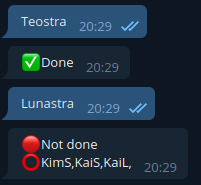
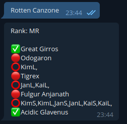

# MHW Telegram Crown Collector Bot
A Telegram Bot, written in Java-/GoogleappsScript and hosted as Google Web App. Built to request, receive and update a spreadsheets data by sending commands and chats using the Telegram Messenger. 

Handles information about multiple users collection of miniature and large crowns in Monster Hunter World: Iceborne. Allows comfortable tracking and updating of MHWs Crown Collector Achievements progress.

Provides simplicity-focused chat responses for monsters and quests in Telegram and a (decently) visually appealing spreadsheet including overview of high chance crown quests (the music-themed ones).

#### "If in doubt - take a bite!"

## Examples

## Setup

1. Create new Telegram Bot
	- save API Token (you'll need that)
 2. Download `example_botsheet.xlsx`, edit and/or rename file and upload to your Google Sheets
	- rename user columns as needed, but leave trailing S and L unchanged ("user1S" -> "examplenameS")
	- this sheet is built for 4 users. fill unused users columns with '1's
3. Open Spreadsheet in Google Sheets
3. Open Script Editor (click Tools -> Script Editor)
4. Remove all code in Script Editor, copy and paste all code in `crownbot.js`
5. Deploy as Web App (click Publish -> Deploy as web app) 
	- `Project Version: "New"`
	- `Execute the app as: "Me (example@gmail.com)"`
	- `Who has access: "Anyone, even anonymous"` (...and the telegram bot)
	- Save resulting web app URL (you'll need that, too)
6. Enter global variable values into the Script Editor
	- `TOKEN` is your Telegram Bot Token aquired in step 1
	- `SHEET_ID` is part of the URL of the Spreadsheet (switch to that tab) 
        - here: https://docs.google.com/spreadsheets/X/`___{SHEET_ID}___`/edit#gid=XXXXXXXXXX "
	- `WEB_APP_URL` is the URL from step 5
	- `ADMIN_ID` is your own Accounts Telegram ID for testing or debugging
	- `ALLOWED_USERS` is a list of Telegram IDs (users) that are allowed to edit data
        - Not on the list? No data editing power. But you can use the bot to view the data. 
        - As can everyone (in bounds of the scripts/bots functionality). Be aware of that!
7. Save 
8. Run Function `setWebhook()` (click Run -> Run Funtion -> setWebhook)
	- Check Logs if function worked as it's supposed to (== no errors)
9. Repeat Step 5 (yes, including `Project Version: "New"`)
10. That's it! Enter your data into the spreadsheet and happy grinding!

#
### Limitations
Be aware that this it neither professionally written nor thoroughly tested code. It's a hobby project. If you experience anything weird, got a question or want to suggest something - send me a message. 
